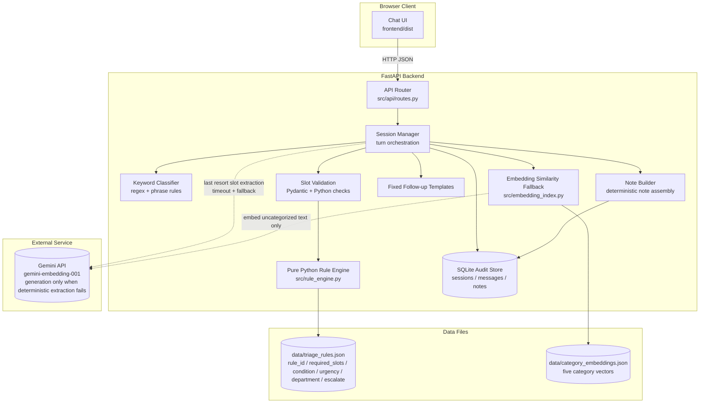

# System Architecture Diagram

```mermaid
flowchart TB
    subgraph Client["Browser Client"]
        UI["Chat UI<br/>frontend/dist"]
    end

    subgraph Server["FastAPI Backend<br/>app.py"]
        API["API Router<br/>src/api/routes.py"]
        SM["Session Manager<br/>turn orchestration"]
        KC["Keyword Classifier<br/>regex + phrase rules"]
        EI["Embedding Similarity Fallback<br/>src/embedding_index.py"]
        SV["Slot Validation<br/>Pydantic + Python checks"]
        RE["Pure Python Rule Engine<br/>src/rule_engine.py"]
        FQ["Fixed Follow-up Templates"]
        NB["Note Builder<br/>deterministic note assembly"]
        DB[("SQLite Audit Store<br/>sessions / messages / notes")]
    end

    subgraph Data["Data Files"]
        RULES[("data/triage_rules.json<br/>rule_id / required_slots / condition / urgency / department / escalate")]
        EMBEDS[("data/category_embeddings.json<br/>five category vectors")]
    end

    subgraph External["External Service<br/>last resort only"]
        GEMINI[("Gemini API<br/>gemini-embedding-001<br/>generation only when deterministic extraction fails")]
    end

    UI -- "HTTP JSON" --> API
    API --> SM
    SM --> KC
    SM --> EI
    EI --> EMBEDS
    EI -. "embed uncategorized text only" .-> GEMINI
    SM --> SV
    SV --> RE
    RE --> RULES
    SM --> FQ
    SM --> NB
    NB --> DB
    SM --> DB
    SM -. "last resort slot extraction<br/>timeout + fallback" .-> GEMINI
```

