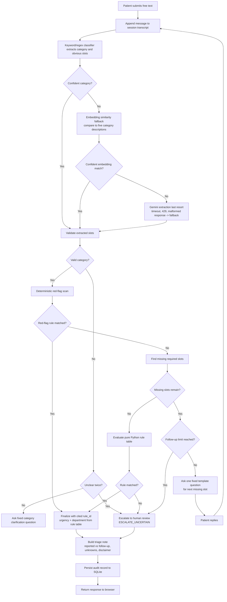

# Workflow Diagram

```mermaid
flowchart TD
    A["Patient submits free text"] --> B["Append message to session transcript"]
    B --> C["Keyword/regex classifier extracts category and obvious slots"]
    C --> D{"Confident category?"}

    D -- "Yes" --> G["Validate extracted slots"]
    D -- "No" --> E["Embedding similarity fallback<br/>compare to five category descriptions"]
    E --> F{"Confident embedding match?"}

    F -- "Yes" --> G
    F -- "No" --> H["Gemini extraction last resort<br/>timeout, 429, malformed response -> fallback"]
    H --> G

    G --> I{"Valid category?"}
    I -- "No" --> J{"Unclear twice?"}
    J -- "No" --> K["Ask fixed category clarification question"]
    J -- "Yes" --> L["Escalate to human review<br/>ESCALATE_UNCERTAIN"]

    I -- "Yes" --> M["Deterministic red-flag scan"]
    M --> N{"Red-flag rule matched?"}
    N -- "Yes" --> O["Finalize with cited rule_id<br/>urgency + department from rule table"]

    N -- "No" --> P["Find missing required slots"]
    P --> Q{"Missing slots remain?"}
    Q -- "No" --> R["Evaluate pure Python rule table"]
    R --> S{"Rule matched?"}
    S -- "Yes" --> O
    S -- "No" --> L

    Q -- "Yes" --> T{"Follow-up limit reached?"}
    T -- "No" --> U["Ask one fixed template question<br/>for next missing slot"]
    U --> V["Patient replies"]
    V --> B
    T -- "Yes" --> L

    O --> W["Build triage note<br/>reported vs follow-up, unknowns, disclaimer"]
    L --> W
    W --> X["Persist audit record to SQLite"]
    X --> Y["Return response to browser"]
```

